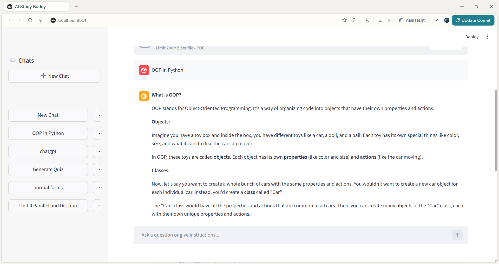

# 🚀 AI Study Buddy

### Intelligent AI-Powered Learning Assistant

> Transform the way you study using Generative AI.

AI Study Buddy is a production-ready AI-powered web application that helps students understand concepts, summarize notes, and generate quizzes instantly using Large Language Models.

---

## 🧠 Overview

AI Study Buddy leverages modern Generative AI APIs to provide:

- 📖 Concept Explanation
- 📝 Smart Notes Summarization
- ❓ Automatic Quiz Generation
- ⚡ Fast Interactive UI
- 🔐 Secure API Key Management

Designed with scalability and security best practices.

## ✨ Key Features

- ✅ Topic-wise explanation using AI
- ✅ Structured note summarization
- ✅ Auto-generated MCQ quizzes
- ✅ Environment variable security
- ✅ Modular project architecture
- ✅ Ready for cloud deployment

---

## 🏗️ Architecture

```text
User → Streamlit UI → AI Helper Module → Groq API → Response → UI
```

### Core Components

- **Frontend:** Streamlit
- **Backend Logic:** Python
- **AI Engine:** Groq LLM API
- **Environment Management:** python-dotenv

---

## 📂 Project Structure

```
AI_Study_Buddy/
│
├── app.py                # Main Streamlit app
├── requirements.txt      # Project dependencies
├── .gitignore            # Ignore sensitive files
├── README.md
│
├── ai/
│   ├── __init__.py
│   └── ai_helper.py      # AI interaction logic
│
└── utils/
    └── (utility modules)
```

---

# 📸 Screenshots

## 📷 Application Preview

### 🏠 Home Page



### 📖 Topic Explanation


### ❓ Quiz Generator


# ⚙️ Installation Guide

## 1️⃣ Clone Repository

```bash
git clone https://github.com/yashkk-07/AI_Study_Buddy.git
cd AI_Study_Buddy
```

---

## 2️⃣ Create Virtual Environment

```bash
python -m venv venv
venv\Scripts\activate
```

---

## 3️⃣ Install Dependencies

```bash
pip install -r requirements.txt
```

---

## 4️⃣ Configure Environment Variables

Create a `.env` file:

```
GROQ_API_KEY=your_api_key_here
```

⚠️ Never commit `.env` to GitHub.

---

## 5️⃣ Run Application

```bash
streamlit run app.py
```

---

# 🌍 Deployment Guide

## 🔹 Option 1: Streamlit Cloud (Recommended for Portfolio)

1. Push project to GitHub
2. Go to Streamlit Cloud
3. Connect GitHub repository
4. Add environment variable:

   - `GROQ_API_KEY`

5. Deploy

---

## 🔹 Option 2: Render Deployment

1. Create Web Service on Render
2. Connect GitHub repo
3. Add environment variable
4. Start command:

   ```
   streamlit run app.py --server.port $PORT --server.address 0.0.0.0
   ```

---

# 🔐 Security Practices

- Environment variables for API keys
- `.gitignore` protection
- No hardcoded credentials
- GitHub push protection enabled

---

# 📈 Future Enhancements

- 🔐 User authentication system
- 📂 PDF upload & summarization
- 🧾 Save study history
- 📊 Analytics dashboard
- 🤖 Multi-model support
- 🧠 Adaptive learning mode

---

# 🎯 Why This Project Stands Out (Resume Section)

- Real-world API integration
- Secure secret management
- Modular Python architecture
- Cloud deployment ready
- Demonstrates AI application engineering skills

---

# 🧑‍💻 Author

**Yash Kandhare**
IT Engineering Student | AI & ML Enthusiast

- 💼 Aspiring AI Engineer
- 🚀 Building intelligent systems
- 📌 Passionate about ML & Generative AI

GitHub: [https://github.com/yashkk-07](https://github.com/yashkk-07)

---

# 📜 License

This project is licensed under the MIT License.

---

# ⭐ Professional Badges (Add at Top)

Add this at the very top of README:

```markdown


```
